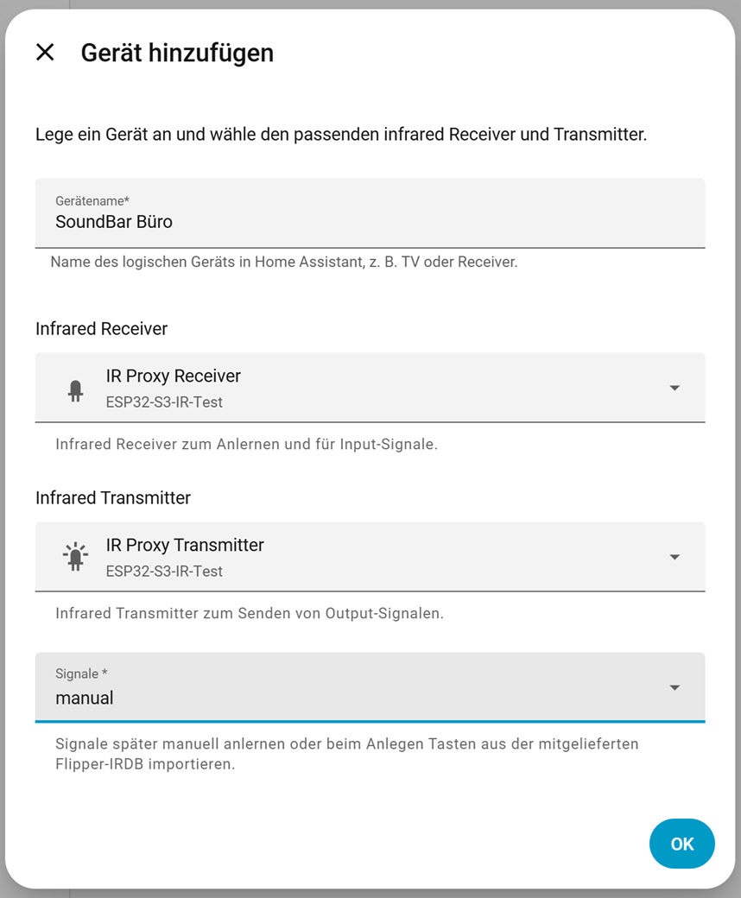
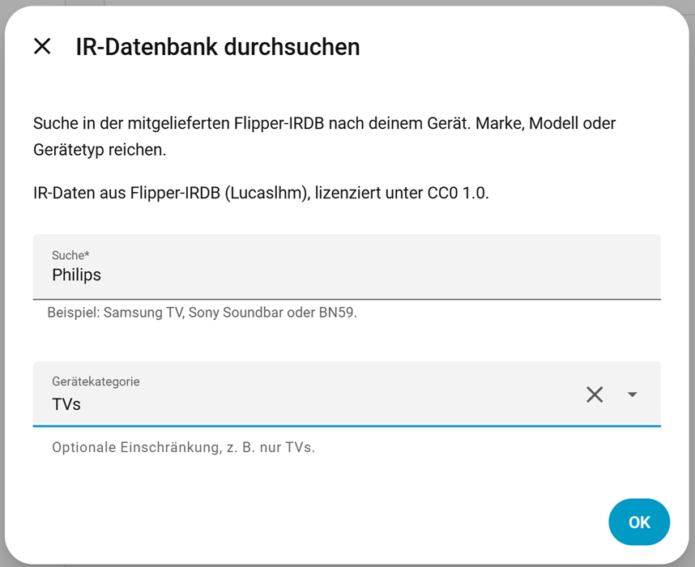
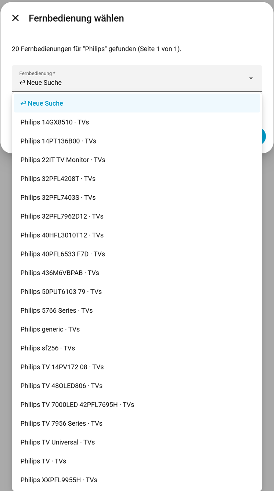
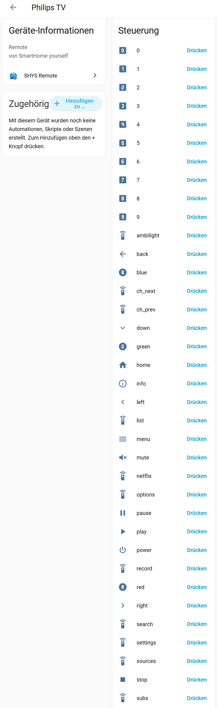
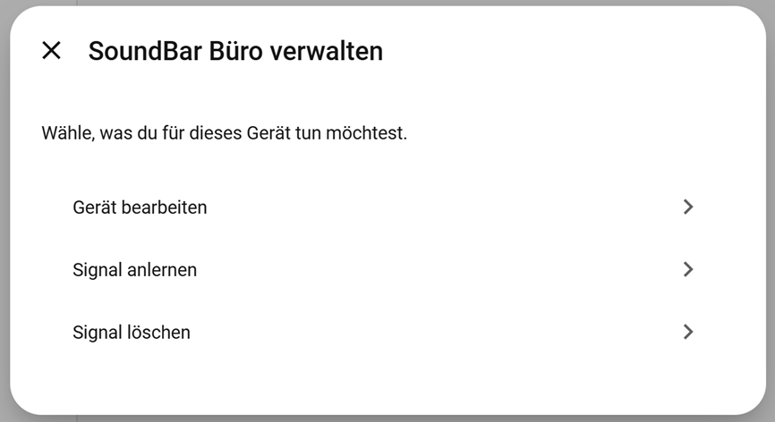
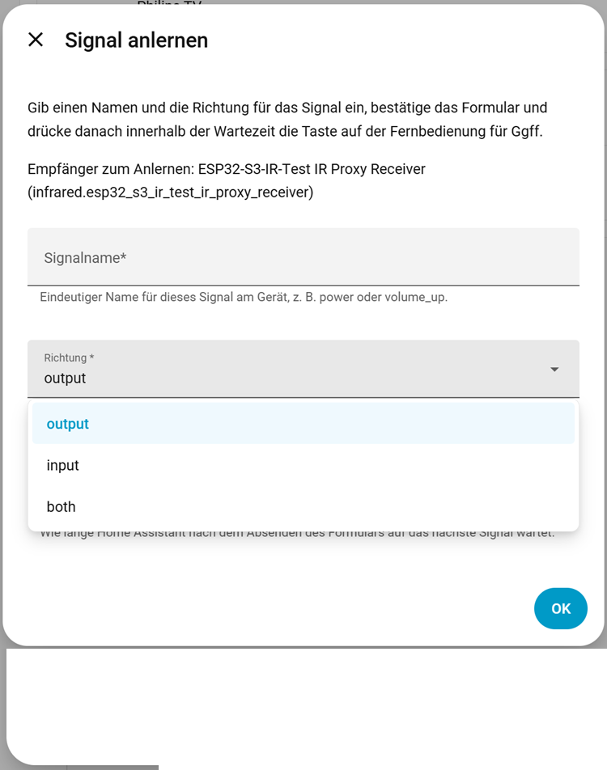
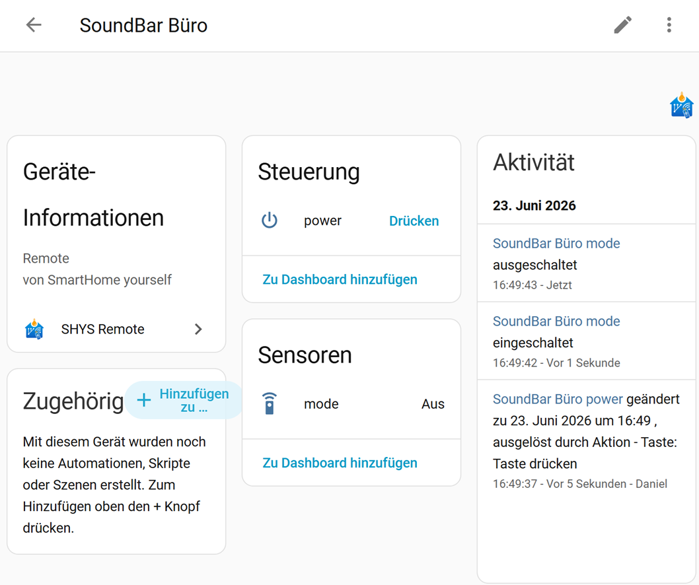
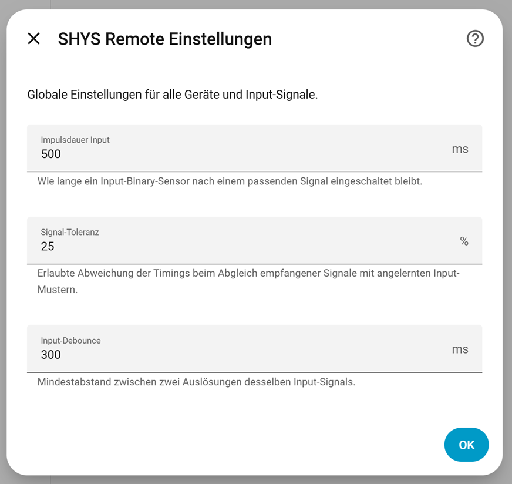

# SHYS Remote

[](https://github.com/hacs/integration)
[](LICENSE)

Home Assistant integration to learn, store and replay remote control signals through the
built-in [`infrared`](https://www.home-assistant.io/integrations/infrared/) integration,
with optional support for
[`radio_frequency`](https://www.home-assistant.io/integrations/radio_frequency/)
transmitters (e.g. 433 MHz OOK devices) on top of the same learned-signal storage.

- **Output signals** become `button` entities and send learned codes.
- **Input signals** become pulsing `binary_sensor` entities when a matching code
  is received.
- **Both** creates a button and a binary sensor for the same signal — useful when
  you want to send and detect the same key.
- **Flipper-IRDB import** lets you search a bundled remote database and import
  supported signals during device setup.

### Signal direction

Every signal (learned manually or imported from IRDB) has a direction:

| Direction | Entities created |
| --- | --- |
| `output` | Send button |
| `input` | Binary sensor (pulses on match) |
| `both` | Send button **and** binary sensor |

## Requirements

- Home Assistant **2025.2** or newer
- An **ESPHome** device (or other hardware) that exposes an **infrared emitter**
  entity in Home Assistant
- An **infrared receiver** entity is optional, but required for learning signals and
  input/binary-sensor features — this applies to RF devices too, since learning always
  captures raw timings through an infrared receiver
- Home Assistant's built-in [**Infrared**](https://www.home-assistant.io/integrations/infrared/)
  integration — SHYS Remote builds on top of it and does not talk to GPIO hardware
  directly
- Optional, for RF devices: Home Assistant **2026.5** or newer for the built-in
  [**Radio Frequency**](https://www.home-assistant.io/integrations/radio_frequency/)
  integration, plus a compatible RF adapter (e.g. ESPHome or Broadlink) exposing a
  radio-frequency transmitter entity

### How the pieces connect

```text
IR hardware (LED + TSOP receiver)
        ↓
ESPHome: remote_receiver / remote_transmitter
        ↓
ESPHome: infrared (ir_rf_proxy)  →  HA entities (receiver + emitter)
        ↓
SHYS Remote  →  learn, send and match signals per logical device
```

When you add a device in SHYS Remote, you first choose the **signal medium** —
**infrared** or **radio frequency** — then pick one matching **transmitter** and
optionally an **infrared receiver** from Home Assistant. The transmitter must exist
before setup — for infrared, usually from an ESPHome node that uses the
[`ir_rf_proxy`](https://esphome.io/components/ir_rf_proxy/) platform; for RF, from
whatever adapter exposes an entity through Home Assistant's **Radio Frequency**
integration. The receiver is always an infrared receiver, even for RF devices, since
learning captures raw timings the same way regardless of medium.

## ESPHome reference setup

Below is a **minimal excerpt** of a working ESP32-S3 configuration (pins and names
are examples — adjust them for your board and wiring).

**Wiring (example):**

| Function | ESPHome component | Example pin |
| --- | --- | --- |
| IR receive | `remote_receiver` | GPIO4 (often `inverted: true` for TSOP modules) |
| IR send | `remote_transmitter` | GPIO6 |

**Relevant YAML:**

```yaml
# Receive raw IR timings from a demodulating receiver (e.g. 38 kHz)
remote_receiver:
  id: ir_rx
  pin:
    number: GPIO4
    inverted: true
  dump: raw

# Drive an IR LED (carrier generated in software)
remote_transmitter:
  id: ir_tx
  pin: GPIO6
  carrier_duty_percent: 50%
  non_blocking: true

# Expose hardware to Home Assistant as infrared entities (one instance each)
infrared:
  - platform: ir_rf_proxy
    name: IR Proxy Receiver
    receiver_frequency: 38kHz
    remote_receiver_id: ir_rx

  - platform: ir_rf_proxy
    name: IR Proxy Transmitter
    remote_transmitter_id: ir_tx
```

After flashing, add the ESPHome device to Home Assistant (**Settings → Devices &
services → ESPHome**). You should then see infrared receiver/emitter entities
(for example under the ESPHome device). Use those when configuring SHYS Remote.

The `api` action `send_raw_ir` in a full firmware is optional — useful for manual
tests from ESPHome/API. **SHYS Remote sends signals through Home Assistant's
Infrared integration**, not through that action.

**Documentation:**

- [ESPHome `remote_receiver`](https://esphome.io/components/remote_receiver/)
- [ESPHome `remote_transmitter`](https://esphome.io/components/remote_transmitter/)
- [ESPHome Infrared / `ir_rf_proxy`](https://esphome.io/components/ir_rf_proxy/)
- [Home Assistant Infrared](https://www.home-assistant.io/integrations/infrared/)

You also need the usual ESPHome building blocks (`esphome:`, `esp32:`, `api:`, `wifi:`,
`ota:`, …) — see the [ESPHome getting started guide](https://esphome.io/guides/getting_started_hassio/).

## RF (radio-frequency) devices

RF support (e.g. 433 MHz OOK devices) reuses the same learn/store/send flow as infrared,
just through a different transmitter backend.

- Requires Home Assistant's built-in
  [**Radio Frequency**](https://www.home-assistant.io/integrations/radio_frequency/)
  integration (added in HA 2026.5) and a compatible RF adapter/proxy exposing a
  transmitter entity — see that integration's docs for supported hardware.
- When adding or editing a device, set **Signal medium** to **Radio frequency**, then
  pick the RF transmitter entity. The transmitter picker only lists entities Home
  Assistant currently knows as infrared or RF emitters.
- SHYS Remote's `shys_remote.send` service and buttons work the same for RF signals; only
  the underlying transmit call differs (`radio_frequency.async_send_command` instead of
  `infrared.async_send_command`).

RF and infrared devices coexist freely — the medium is a per-device setting, not a global
integration option.

Flipper-IRDB only contains infrared codes, so use **manual learning** (not IRDB import)
for RF devices.

### Learning RF signals (receiver workaround)

The **receiver** picker only ever lists infrared receiver entities, for RF devices too.
This is intentional, not a bug: as of Home Assistant Core 2026.7.2, the built-in
`radio_frequency` integration only creates *transmitter* entities. Home Assistant's
`esphome` integration filters incoming entities by their capability bits
(`homeassistant/components/esphome/radio_frequency.py`) and only keeps ones that
advertise transmit support — a receive-only RF proxy is silently dropped and never
becomes a Home Assistant entity, however correctly your ESPHome device announces it.
This is a current gap in Home Assistant Core, not something SHYS Remote can work around
in code, and may change once Home Assistant ships a native RF receiver entity.

Until then, learn RF signals through a receiver exposed via the **infrared** platform
instead — raw pulse/space timings are protocol-agnostic there, so an `ir_rf_proxy`
instance wired to your RF receiver hardware works for capturing RF codes even though
Home Assistant sees it as an infrared entity. For example, on a KinCony KC868-AG with
separate IR and RF receiver/transmitter pins:

```yaml
remote_receiver:
  - id: ir_rx
    pin:
      number: GPIO23
      inverted: true
    dump: raw
  - id: rf_rx
    pin: GPIO13
    dump:
      - rc_switch
      - raw
    filter: 50us       # keep short pulses - don't cut them off
    idle: 30ms          # keep the sync gap between repeats intact
    tolerance: 60%
    buffer_size: 8kb    # room for a long multi-repeat burst

remote_transmitter:
  - id: ir_tx
    pin: GPIO2
    carrier_duty_percent: 50%
    non_blocking: true
  - id: rf_tx
    pin: GPIO22
    carrier_duty_percent: 100%
    non_blocking: false  # blocking send, for reliable RAW replay

infrared:
  - platform: ir_rf_proxy
    name: IR Proxy Receiver
    receiver_frequency: 38kHz
    remote_receiver_id: ir_rx
  - platform: ir_rf_proxy
    name: IR Proxy Transmitter
    remote_transmitter_id: ir_tx
  - platform: ir_rf_proxy
    name: RF Learning Receiver
    remote_receiver_id: rf_rx

radio_frequency:
  - platform: ir_rf_proxy
    name: RF Proxy Transmitter
    frequency: 433.92MHz
    remote_transmitter_id: rf_tx
```

Notes on this config:

- `RF Learning Receiver` deliberately has no `receiver_frequency` — that field is IR
  demodulation metadata only (no hardware effect) and doesn't apply to raw RF capture.
- `dump` includes `rc_switch` purely as an ESPHome-side diagnostic — it's what shows
  "protocol=4" in the ESPHome logs when a signal is received. SHYS Remote never reads
  that decoded output; it only ever consumes the `raw` timings (see ["Learn and send
  use the exact same raw format"](#learn-and-send-use-the-exact-same-raw-format) below
  for why). `dump: raw` alone works exactly the same for SHYS Remote's purposes.
- There is no native `radio_frequency:` receiver block for `rf_rx`. Home Assistant
  wouldn't create an entity for it anyway (see above), so it would just be dead
  configuration.
- In SHYS Remote, pick `RF Learning Receiver` as the **Receiver** and `RF Proxy
  Transmitter` as the **Transmitter** for an RF device — both are needed for `input`/
  `both` direction signals; output-only RF devices only need the transmitter.
- `filter`/`idle`/`buffer_size` and `non_blocking: false` are verified-working values
  for capturing and replaying a complete multi-repeat burst (see
  [RF Hardware Setup](#rf-hardware-setup) below for why each one matters and what
  happens if you get them wrong).

This workaround is expected to stay necessary for a while: Home Assistant's `radio_frequency`
entity platform launched transmitter-only by design, with receiver entities explicitly
deferred to a future proposal (see the
[architecture discussion](https://github.com/home-assistant/architecture/discussions/1365)).
There is currently no version of Home Assistant Core where a native RF receiver entity
exists, so this isn't something a future SHYS Remote release can remove on its own.

### RF Hardware Setup

RF support has been verified end-to-end on two different receiver/transmitter platforms
— a cheap OOK module and a proper Sub-GHz transceiver — both reliably switching a
433 MHz Emil-Lux remote socket through SHYS Remote. Neither example needs any
hardware-specific code in SHYS Remote itself (see ["Using other RF
hardware"](#using-other-rf-hardware-eg-cc1101) below) — the settings below are about
getting a clean, complete RAW capture out of the ESPHome side, which matters more than
which chip you use.

#### KinCony KC868-AG (ESP32, cheap OOK module)

```yaml
remote_receiver:
  - id: rf_rx
    pin: GPIO13
    dump:
      - rc_switch
      - raw
    filter: 50us
    idle: 30ms
    tolerance: 60%
    buffer_size: 8kb

remote_transmitter:
  - id: rf_tx
    pin: GPIO22
    carrier_duty_percent: 100%
    non_blocking: false

infrared:
  - platform: ir_rf_proxy
    name: RF Learning Receiver
    remote_receiver_id: rf_rx

radio_frequency:
  - platform: ir_rf_proxy
    name: RF Proxy Transmitter
    frequency: 433.92MHz
    remote_transmitter_id: rf_tx
```

This is the same wiring as the full IR+RF example above, with just the RF pins shown
here. See that example for the complete file including the IR receiver/transmitter.

#### CC1101 + ESP32-S3 (Sub-GHz transceiver)

```yaml
spi:
  id: spi_bus
  clk_pin: GPIO13
  mosi_pin: GPIO11
  miso_pin: GPIO12

cc1101:
  id: cc1101_module
  cs_pin: GPIO10
  spi_id: spi_bus
  frequency: 433.92MHz
  output_power: 10
  modulation_type: ASK/OOK
  symbol_rate: 5000
  filter_bandwidth: 203kHz
  # gdo0_pin intentionally NOT set here - see the ESPHome #16876 note below.

remote_receiver:
  id: rf_rx
  pin:
    number: GPIO8        # GDO2
    mode:
      input: true
  dump:
    - rc_switch
    - raw
  tolerance: 60%
  filter: 50us
  idle: 30ms
  buffer_size: 8kb

remote_transmitter:
  id: rf_tx
  pin:
    number: GPIO9        # GDO0
    mode:
      output: true
  carrier_duty_percent: 100%
  non_blocking: false
  on_transmit:
    then:
      - cc1101.begin_tx: cc1101_module
      - delay: 2ms
  on_complete:
    then:
      - cc1101.begin_rx: cc1101_module

radio_frequency:
  - platform: ir_rf_proxy
    name: RF Proxy Transmitter
    frequency: 433.92MHz
    remote_transmitter_id: rf_tx

infrared:
  - platform: ir_rf_proxy
    name: RF Learning Receiver
    frequency: 433.92MHz
    remote_receiver_id: rf_rx
```

**ESPHome issue [#16876](https://github.com/esphome/esphome/issues/16876):** on the
ESP32-S3, setting `gdo0_pin` inside the `cc1101:` block breaks the chip's RMT pin
routing and no RF is transmitted at all — the ESPHome logs look normal, but nothing
goes over the air. The fix is to leave `gdo0_pin` unset in the `cc1101:` block and wire
GDO0/GDO2 through the `remote_transmitter`/`remote_receiver` pins instead, as in the
example above. This is specific to the ESP32-S3; the classic ESP32 isn't affected.
The `on_transmit`/`on_complete` automations are what switch the CC1101 between its TX
and RX radio states — `cc1101.begin_tx` before sending, `cc1101.begin_rx` right after,
with a short `delay: 2ms` to let the chip settle into TX mode first. Without these
hooks the chip just stays in whichever mode it was last in.

#### Setting up the ESPHome device

How to actually get one of the YAML examples above onto a device, using the ESPHome
add-on's built-in web UI (no separate ESPHome CLI/IDE needed):

1. Install the ESPHome add-on in Home Assistant: **Settings → Add-ons → Add-on Store →
   ESPHome → Install**.
2. Open **ESPHome** from the sidebar and click **+ New device**.
3. Enter a device name and select your board type (e.g. **ESP32-S3 DevKitC-1** for the
   CC1101 example, or **ESP32** for the KC868-AG).
4. Replace the generated YAML with the appropriate example from above.
5. Adjust the device name and Wi-Fi credentials for your network — use `secrets.yaml`
   rather than hardcoding them, e.g. `ssid: !secret wifi_ssid`.
6. Click **Install**:
   - First flash: **Plug into this computer** (USB/serial).
   - Every update after that: **Wirelessly** (OTA) — no more cabling needed.
7. Once flashed, the device is usually discovered automatically under **Settings →
   Devices & services → ESPHome**. If it isn't, add it manually: **Add integration →
   ESPHome → enter the device's IP address**.
8. In SHYS Remote, add or edit a device and pick **RF Learning Receiver** and **RF
   Proxy Transmitter** (the entity names from the YAML) as receiver and transmitter.

#### Cheap OOK modules (FS1000A, XY-MK-5V and similar)

These work the same way as the KC868-AG example above: a plain GPIO-driven transmitter
and receiver, no SPI, no mode-switching automations. Wire the module's data pin to
`remote_receiver`/`remote_transmitter` the same way, apply the same `filter`/`idle`/
`tolerance`/`buffer_size` settings, and set `carrier_duty_percent: 100%` on the
transmitter — that's the whole difference from a KC868-AG setup.

#### RF receiver/transmitter parameters

These matter regardless of which chip is behind them - the values below are verified
working defaults, not just a starting point to tune from:

| Parameter | Recommended value | Why |
| --- | --- | --- |
| `filter` (receiver) | `50us` | Filters out sub-50µs glitches. Higher values (250µs+) start cutting off real short pulses, producing incomplete or inconsistent captures. |
| `idle` (receiver) | `30ms` (at least 20–30ms) | Ends a capture once the line has been quiet this long. Too short (e.g. 10ms) splits the gap *between* repeats inside one burst, fragmenting a single multi-repeat signal into several separate, incomplete captures. |
| `buffer_size` (receiver) | `8kb` | The default buffer is too small for a long RAW dump covering several repeated cycles - too small silently truncates the capture. |
| `non_blocking` (transmitter) | `false` | A non-blocking send can return before the full RAW sequence has actually gone out, cutting the transmission short. `false` blocks until sending is complete, which is what reliable RAW replay needs. |
| `tolerance` (receiver) | `60%` | Wide enough to tolerate the timing jitter cheap OOK hardware and fixed-code remotes typically produce, without merging genuinely different signals together. |
| `carrier_duty_percent` (transmitter) | `100%` | RF hardware generates its own carrier; anything other than 100% makes the ESP32 additionally modulate the line in software, corrupting the envelope (see ["If a learned RF signal doesn't control the device"](#if-a-learned-rf-signal-doesnt-control-the-device)). |

### Learn and send use the exact same raw format

Learning and sending do **not** go through different data formats. Both the infrared and
radio-frequency backends store and replay the identical `list[int]` mark/space microsecond
sequence Home Assistant hands back from `InfraredReceivedSignal.timings` — SHYS Remote never
decodes, re-encodes or otherwise transforms it (see `manager.build_command()` and
`signal_transport.build_rf_command()`). No protocol (rc_switch, Intertechno, NEC, …) is ever
assumed; this is a pure record-and-replay design and works with any ESPHome-compatible
transmitter/receiver pair. If a learned RF signal doesn't work, the raw capture itself is
the first thing to check — not this integration's plumbing.

**Why RAW instead of a decoded protocol like rc_switch:** ESPHome's `remote_receiver` can
optionally *also* decode certain known encodings (`dump: rc_switch` shows up in the ESPHome
logs as e.g. `Received rc_switch: protocol=4` when it recognizes one) — but that's purely a
diagnostic feature of ESPHome itself, and SHYS Remote never reads that decoded output.
Relying on it would mean hardcoding a specific protocol and its parameters (address,
channel, pulse length), which breaks the moment a remote uses an encoding rc_switch doesn't
know, and defeats the hardware-agnostic goal of this integration. Recording and replaying
the raw waveform verbatim works regardless of what protocol - known or not - produced it.

This matters in practice for common hardware-store remote sockets (Emil-Lux, Tronic, OBI,
Brennenstuhl and similar 433 MHz sets): a single button press typically transmits a burst
of about 4 repeated cycles. These are generally **not** a security rolling code — the
remote is sending its (up to) 4 channel codes one after another in sequence within that
burst, not a single code repeated for reliability. Capturing and replaying the whole burst
as one RAW recording (see [RF Hardware Setup](#rf-hardware-setup) above for the receiver
settings that make sure the capture isn't cut short) reproduces this correctly without
SHYS Remote ever needing to know that's what's happening.

### If a learned RF signal doesn't control the device

Quick reference:

| Symptom | Likely cause | Fix |
| --- | --- | --- |
| Socket doesn't react at all | Capture cut short or fragmented | Check `filter`/`idle`/`buffer_size` (see [RF Hardware Setup](#rf-hardware-setup)) |
| Reception is inconsistent between attempts | Capture fragmenting mid-burst | Increase `idle` (30ms is a good starting point) |
| CC1101 sends no RF at all (logs look fine) | ESPHome bug [#16876](https://github.com/esphome/esphome/issues/16876) | Remove `gdo0_pin` from the `cc1101:` block (ESP32-S3 only) |
| Signal gets split into several separate captures | `idle` too short for a multi-repeat burst | Increase `idle` to 30ms |

Since learning captures whatever the receiver hardware reports, byte for byte, a bad capture
is stored and replayed just as faithfully as a good one. In practice, on cheap 433 MHz OOK
receiver modules:

- RF learning takes a single capture — **hold the button down** until the signal is
  captured, rather than tapping it. Many remotes (e.g. Emil-Lux/Tronic-style sockets) send
  a burst of several repeated cycles per press, sometimes with rotating/jittering content
  between repeats; holding the button lets the ESPHome receiver's own idle timeout capture
  the *whole* burst as one raw dump instead of cutting it off after the first repeat. SHYS
  Remote only rejects a capture that's implausibly short (a stray AGC glitch, not a protocol
  check) — it does not compare it against a second attempt, since two independent presses of
  a rotating-code remote are expected to differ.
- Move the receiver antenna away from the ESP32/WiFi/USB noise sources, and closer to
  the remote during learning.
- On ESP32, a dedicated receiver chip (e.g. **CC1101**) generally decodes far more
  consistently than a bare OOK/ASK receiver module (e.g. FS1000A/XY-MK-5V-class boards),
  because it does its own signal conditioning instead of relying on the ESP32 to sample a
  noisy analog line.
- Check the `remote_receiver`'s `filter`/`idle` timing in your ESPHome YAML — too short an
  `idle` cuts a real multi-repeat burst into fragments (only the first repeat gets learned);
  too long merges unrelated noise into one capture.
- On the transmit side, make sure the RF `remote_transmitter` has `carrier_duty_percent: 100%`
  (see the example above) — RF hardware does its own carrier generation, and any other duty
  cycle tells the ESP32 to additionally modulate the line in software, which corrupts the
  raw envelope for genuinely fixed-code OOK receivers.
- If receiving still won't decode consistently even on a CC1101, but sending confirms RF
  energy is emitted, treat it as a receiver/antenna/firmware issue to resolve on the ESPHome
  side rather than something to work around in SHYS Remote — this integration only stores
  and replays whatever timings the receiver reports.

### Using other RF hardware (e.g. CC1101)

SHYS Remote has no vendor- or chip-specific code anywhere — it only ever talks to standard
Home Assistant `infrared`/`radio_frequency` entities, whatever integration created them. Any
ESPHome device (or Broadlink, or any other integration implementing those platforms) works
the moment it exposes such an entity; nothing needs adjusting in SHYS Remote itself. If a
device's entities don't show up in the transmitter/receiver picker, that always means Home
Assistant never created an entity for it — check the device's own ESPHome YAML and online
status first. The **Add device** step now shows a hint directly in Home Assistant when no
transmitter entities are found at all, pointing back here.

A common cause with **CC1101** boards specifically: unlike a bare FS1000A/XY-MK-5V module
that just needs a GPIO pin, the CC1101 is a real SPI radio and needs to be told when to
switch between transmit and receive mode. Wiring it under the wrong ESPHome platform (
`infrared:` instead of `radio_frequency:`), or omitting the mode-switch callbacks, results
in an ESPHome device that looks fine in the ESPHome logs but never creates a usable entity
in Home Assistant — indistinguishable, from SHYS Remote's side, from a device that was never
flashed. This requires **ESPHome 2026.5.0 or newer** (CC1101 support in the `radio_frequency:`
platform).

A fully worked, verified CC1101 + ESP32-S3 example — including the `on_transmit`/
`on_complete` mode-switch hooks and the ESP32-S3-specific `gdo0_pin` pitfall
([ESPHome #16876](https://github.com/esphome/esphome/issues/16876)) — is in
[RF Hardware Setup](#rf-hardware-setup) above. See ESPHome's
[`cc1101`](https://esphome.io/components/cc1101/) docs for the full option list (dual-pin
vs. single-pin wiring, output power, symbol rate) and adjust pins for your board.

## Installation

### HACS (recommended after repository publish)

1. Add this repository as a [custom HACS repository](https://hacs.xyz/docs/faq/custom_repositories/).
2. Install **SHYS Remote**.
3. Restart Home Assistant.

### Manual

Copy `custom_components/shys_remote` into your Home Assistant
`config/custom_components/` directory and restart Home Assistant.

## Quick start

1. Open **Settings → Devices & services → Add integration**.
2. Search for **SHYS Remote** and complete the setup wizard.
3. Open the integration card and choose **Add device**.
4. Enter a device name, choose the **signal medium** (infrared or radio frequency),
   select your transmitter (receiver optional), and pick how to populate signals
   (manual, or Flipper-IRDB import — the bundled database only contains infrared
   codes, so use manual learning for RF devices).

<p align="center">
  
</p>

Each logical device appears as its own device in Home Assistant. Depending on the
chosen direction, signals become buttons, binary sensors, or both.

### Option A — Import from Flipper-IRDB

Choose **Import from IR database** when adding the device. Search by brand, model or
device type and optionally filter by category.

<p align="center">
  
</p>

Pick a matching remote from the results. On the next step, choose the signal
direction (`output`, `input` or `both`) and confirm the import.

<p align="center">
  
</p>

<p align="center">
  
</p>

By default, IRDB imports use **output** (send buttons). Choose **both** if you also
want binary sensors for automations when the same keys are received.
If no receiver is configured on the device, only **output** is available.

### Option B — Learn signals manually

Leave the signal source on **manual**, then open **Manage device** on the integration
card and choose **Learn signal**.

<p align="center">
  
  &nbsp;
  
</p>

Select **output**, **input** or **both**, submit the form, then press the button on
the physical remote within the timeout.
Learning is only available when a receiver is configured on the device.

For **RF devices**, hold the button down until the signal is captured, rather than
tapping it — many remotes send a burst of several repeated cycles per press, and holding
the button lets the receiver's raw capture include the whole burst instead of just the
first repeat. RF learning is a single capture, same as IR; it's only rejected if
implausibly short (a stray glitch, not a protocol check) — see
["If a learned RF signal doesn't control the device"](#if-a-learned-rf-signal-doesnt-control-the-device)
for further troubleshooting.

<p align="center">
  
</p>

## Device options

When adding or editing a device you can configure how output signals are sent:

| Option | Description |
| --- | --- |
| Send repetitions | How many times each signal is sent in a row (default: 1) |
| Delay between repetitions | Wait time between consecutive sends in milliseconds (default: 45 ms) |

Some devices (for example Sony TVs with SIRC) need multiple repeats to react reliably.

## Integration options

Under **Configure** on the integration card you can tune matching and input behaviour
for all devices:

<p align="center">
  
</p>

| Option | Description |
| --- | --- |
| Input pulse duration | How long input binary sensors stay `on` after a match |
| Signal match tolerance | Allowed timing deviation when matching received patterns |
| Input debounce | Minimum time between two triggers of the same input signal |

## Services

| Service | Description |
| --- | --- |
| `shys_remote.learn` | Learn a new signal on a device (requires receiver) |
| `shys_remote.send` | Send a learned output signal |
| `shys_remote.delete` | Delete a learned signal and its entity |

The `device` parameter is the device **slug** shown in the subentry settings
(for example `soundbar_buro`).

The `direction` parameter for `learn` accepts `output`, `input` or `both`.

Example — learn an output signal:

```yaml
service: shys_remote.learn
data:
  device: soundbar_buro
  name: power
  direction: output
  timeout: 15
```

Example — learn a signal for sending and receiving:

```yaml
service: shys_remote.learn
data:
  device: soundbar_buro
  name: power
  direction: both
  timeout: 15
```

## Flipper-IRDB

The search index is shipped locally in `data/irdb_index.json`. Individual `.ir`
files are downloaded from GitHub only when you import a remote.

- Source: [Flipper-IRDB](https://github.com/Lucaslhm/Flipper-IRDB)
- License: [CC0 1.0](https://creativecommons.org/publicdomain/zero/1.0/)
- Details: see [`data/IRDB_NOTICE.md`](data/IRDB_NOTICE.md)

### Supported signal formats

| Type / protocol | Status | Notes |
| --- | --- | --- |
| `raw` | Supported | Used by many ACs, Pioneer receivers, etc. |
| `NEC`, `NECext`, `NEC42`, `NEC42ext` | Supported | Common for many TVs and accessories |
| `Samsung32` | Supported | |
| `RC5`, `RC5X`, `RC6` | Supported | |
| `SIRC`, `SIRC15`, `SIRC20` | Supported | Sony TVs and devices |
| `Kaseikyo` | Supported | Panasonic TVs, Denon/Marantz AVRs, Technics, etc. |
| `Sharp` | Supported | When present as parsed protocol |
| `RCA` | Not yet | Flipper-specific protocol (distinct from NEC) |
| `Pioneer` | Not yet | Many Pioneer remotes in IRDB use `raw` instead |
| `parsed_array` | Not yet | Multi-frame commands (e.g. some AC profiles) |

Unsupported signals in a remote are skipped during import; the remote can still
be saved if at least one signal is supported.

To analyse protocol usage across the bundled index, run
`scripts/analyze_irdb_protocols.py` from the component directory.

## Removal

1. Delete the **SHYS Remote** integration under **Settings → Devices & services**.
2. Remove `custom_components/shys_remote` from your configuration directory.
3. Restart Home Assistant.

Optional: delete `.storage/shys_remote` if you no longer need learned signals.

## License

Integration code: [MIT](LICENSE)

Flipper-IRDB data: [CC0 1.0](https://creativecommons.org/publicdomain/zero/1.0/)

---

# SHYS Remote (Deutsch)

Home-Assistant-Integration zum Anlernen, Speichern und Senden von
Fernbedienungssignalen über die eingebaute `infrared`-Integration, optional auch über
[`radio_frequency`](https://www.home-assistant.io/integrations/radio_frequency/)
(z. B. 433-MHz-OOK-Geräte) auf Basis derselben Signal-Speicherung.

- **Output:** Buttons zum Senden
- **Input:** Binärsensoren bei erkanntem Signal
- **Beides:** Button und Binärsensor für dasselbe Signal
- **Flipper-IRDB:** Lokale Suche und Import beim Gerät anlegen (nur Infrarot-Codes)

### Signalrichtung

| Richtung | Angelegte Entitäten |
| --- | --- |
| `output` | Sende-Button |
| `input` | Binärsensor (kurzer Impuls bei Treffer) |
| `both` | Sende-Button **und** Binärsensor |

### Hardware (ESPHome)

SHYS Remote spricht nicht direkt mit GPIO — es nutzt die Home-Assistant-Integration
[**Infrared**](https://www.home-assistant.io/integrations/infrared/). Dafür brauchst
du ein Gerät (typisch **ESPHome**), das mindestens einen Sender als infrared-Entität
bereitstellt. Ein Empfänger ist optional, aber für Input/Binärsensoren und Anlernen nötig.

Kurz: `remote_receiver` + `remote_transmitter` in ESPHome, darüber je eine Instanz
[`infrared` / `ir_rf_proxy`](https://esphome.io/components/ir_rf_proxy/) — dann das
ESPHome-Gerät in HA einbinden. Beim Anlegen eines SHYS-Remote-Geräts wählst du zuerst
das **Signal-Medium** (Infrarot oder Funk), dann die passende Transmitter-Entität und
optional eine Empfänger-Entität aus.

Ausführliches Beispiel mit YAML und Links: Abschnitt **ESPHome reference setup** oben.

### Funk (RF)

Für RF-Geräte (z. B. 433-MHz-OOK) brauchst du Home Assistant **2026.5+** mit der
eingebauten [**Radio Frequency**](https://www.home-assistant.io/integrations/radio_frequency/)
Integration sowie einen kompatiblen RF-Adapter, der eine Transmitter-Entität
bereitstellt. Da Flipper-IRDB nur Infrarot-Codes enthält, lerne RF-Signale manuell an
statt sie zu importieren.

Der **Empfänger** bleibt auch bei RF-Geräten ein Infrared-Empfänger — das ist bewusst so,
kein Bug: Home Assistants `radio_frequency`-Integration erzeugt (Stand HA Core 2026.7.2)
ausschließlich Transmitter-Entities. Reine RF-Empfänger werden von der
`esphome`-Integration anhand des fehlenden `TRANSMITTER`-Capability-Bits
herausgefiltert und erscheinen dadurch nie als Home-Assistant-Entity — unabhängig davon,
wie korrekt dein ESPHome-Gerät sie meldet. Bis Home Assistant das nativ unterstützt,
lernst du RF-Signale stattdessen über eine zusätzlich als `infrared` eingebundene
Proxy-Receiver-Entity an, da rohe Puls-/Pause-Timings dort protokollunabhängig sind.
Konkretes ESPHome-Beispiel (KinCony KC868-AG) und Details: Abschnitt **Learning RF
signals (receiver workaround)** oben.

RF wurde auf zwei Hardware-Plattformen verifiziert (KinCony KC868-AG mit einfachem
OOK-Modul, sowie CC1101 + ESP32-S3) — beide schalten eine 433-MHz-Funksteckdose
zuverlässig. Wichtig für einen vollständigen, unverfälschten RAW-Capture (gilt für
jede Hardware): `filter: 50us`, `idle: 30ms` (mindestens 20–30 ms, sonst wird ein
Mehrfach-Burst in Fragmente zerteilt), `buffer_size: 8kb` sowie am Transmitter
`non_blocking: false`. Baumarkt-Funksteckdosen (Emil-Lux, Tronic, OBI, Brennenstuhl
u. ä.) senden pro Tastendruck typischerweise einen Burst aus ca. 4 Zyklen — meist kein
Rolling Code, sondern die (bis zu) 4 Kanalcodes nacheinander in einer Aussendung.
Für CC1101 auf dem ESP32-S3 gilt zusätzlich: `gdo0_pin` **nicht** im `cc1101:`-Block
setzen (ESPHome-Bug
[#16876](https://github.com/esphome/esphome/issues/16876), unterbricht sonst das
RMT-Pin-Routing und es wird kein RF gesendet); stattdessen über die Pins von
`remote_transmitter`/`remote_receiver` verdrahten, siehe Abschnitt **RF Hardware
Setup** oben für die vollständigen, getesteten YAML-Beispiele beider Plattformen.

**ESPHome-Gerät einrichten:** ESPHome-Add-on installieren (**Einstellungen → Add-ons
→ Add-on-Store → ESPHome**), dort ein **neues Gerät** anlegen, Board-Typ wählen
(z. B. ESP32-S3 DevKitC-1 für CC1101, ESP32 für den KC868-AG), das generierte YAML
durch das passende Beispiel aus **RF Hardware Setup** oben ersetzen, Gerätename und
WLAN-Zugangsdaten anpassen (über `secrets.yaml`, z. B. `ssid: !secret wifi_ssid`).
Erstes Flashen per USB-Kabel, alle weiteren Updates drahtlos (OTA). Danach erscheint
das Gerät meist automatisch unter **Einstellungen → Geräte & Dienste → ESPHome** —
sonst manuell über **Integration hinzufügen → ESPHome** mit der IP-Adresse. In SHYS
Remote dann beim Gerät die neuen Entitäten `RF Learning Receiver` und `RF Proxy
Transmitter` als Empfänger/Transmitter auswählen. Ausführliche Schritt-für-Schritt-
Anleitung: Abschnitt **Setting up the ESPHome device** oben.

### Geräteoptionen

Beim Anlegen oder Bearbeiten eines Geräts kannst du das Sendeverhalten festlegen:

| Option | Beschreibung |
| --- | --- |
| Sendewiederholungen | Wie oft jedes Signal hintereinander gesendet wird (Standard: 1) |
| Pause zwischen Wiederholungen | Wartezeit zwischen den Sendungen in Millisekunden (Standard: 45 ms) |

Manche Geräte (z. B. Sony-TVs mit SIRC) reagieren erst zuverlässig bei mehreren Wiederholungen.

### Unterstützte IRDB-Protokolle

Siehe Tabelle im Abschnitt **Flipper-IRDB** oben. Neu: **Kaseikyo** (Panasonic, Denon,
Marantz u. a.). Noch offen: Flipper-`RCA`, Flipper-`Pioneer` und `parsed_array`.
Viele Pioneer-Profile in der IRDB nutzen bereits `raw` und funktionieren deshalb.

### Kurzstart

1. Integration **SHYS Remote** hinzufügen
2. Unter der Integration **Gerät hinzufügen** — Name, Signal-Medium (Infrarot/Funk),
   optional Empfänger, Transmitter und Signalquelle wählen (siehe Screenshot oben)
3. **Flipper-IRDB:** Datenbank durchsuchen, Fernbedienung wählen, im
   Bestätigungsschritt die Richtung festlegen (`output`, `input` oder `both`) →
   Signale werden importiert (ohne Empfänger nur `output`)
4. **Manuell:** Unter **Gerät verwalten → Signal anlernen** Richtung wählen
   (Senden, Empfangen oder Beides), Formular absenden und Taste auf der
   Fernbedienung drücken (nur verfügbar, wenn ein Empfänger konfiguriert ist)

Screenshots und Ablauf: Abschnitt **Quick start** oben (Oberfläche auf Deutsch).

Dokumentation in Home Assistant: Integrationskarte → **Dokumentation** (Link
aus `manifest.json`).
